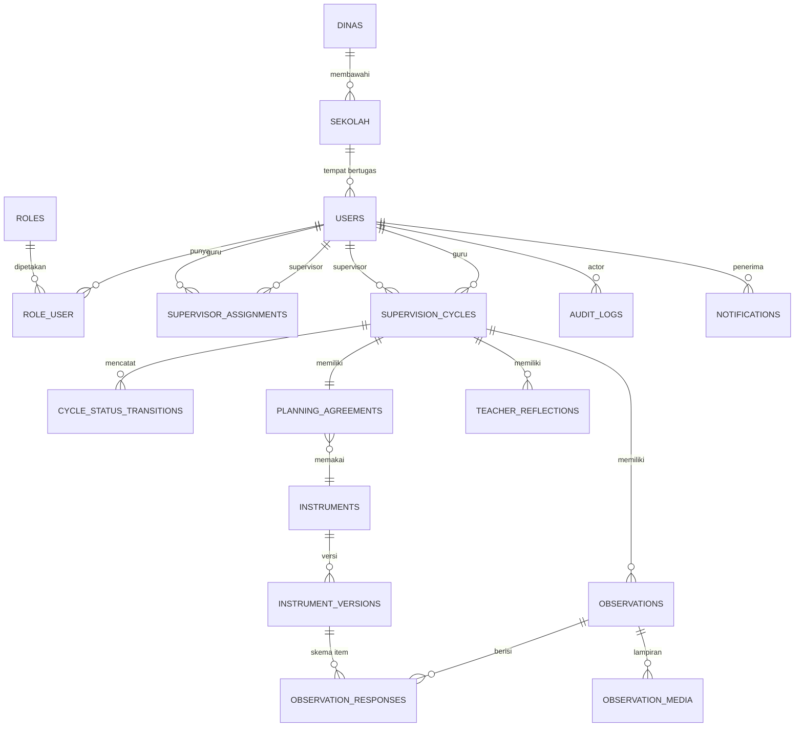
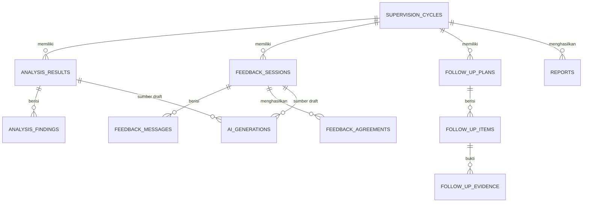

# Skema Basis Data — ERD & Catatan

Status: **DRAFT.** Entitas inti (Spec §7) dikunci untuk Fase 1–2. Entitas modul **Provisional** (Analysis, Feedback, FollowUp, Reporting, Ai) dicantumkan sebagai rancangan *extensible* — **tidak dikunci** sampai Gate 6/7 SLR (Spec §13, `risk-register.md` R-01).

Konvensi: PK `uuid` (v7). `timestamps` di semua tabel domain. `deleted_at` di tabel bertanda †. Semua FK domain inti `ON DELETE RESTRICT`.

---

## ERD inti (Fase 1–2) — Mermaid

## ERD tahap pasca-observasi (PROVISIONAL — rancangan awal)

---

## Kamus entitas

### Identity / Organization (Fase 1)

**`dinas`** — `id`, `nama`, `kode`, `provinsi`, `tipe` (kabupaten/kota), `timestamps`
**`sekolah`** † — `id`, `dinas_id` FK, `nama`, `npsn`, `jenjang` (SD/SMP/SMA/SMK), `kecamatan`, `alamat`, `timestamps`
**`users`** † — `id`, `sekolah_id` FK nullable (Admin Dinas/Sistem tanpa sekolah), `nama`, `email` unik, `password`, `nip`, `supervisor_type` nullable (`kepala_sekolah`|`pengawas`), `jabatan`, `is_active`, `email_verified_at`, `last_login_at`, `timestamps`
**`roles`** — `id`, `name` (`guru`|`supervisor`|`admin_dinas`|`admin_sistem`), `label`
**`permissions`** — `id`, `name`, `domain`
**`role_user`** — `role_id`, `user_id`, `dinas_id` nullable (scope Admin Dinas), unik (role,user)
**`permission_role`** — `permission_id`, `role_id`
**`supervisor_assignments`** — `id`, `supervisor_id` FK users, `guru_id` FK users, `created_by` FK nullable, `mulai`, `selesai` nullable, unik (supervisor,guru,periode)

### Supervision (Fase 1–2) — jantung sistem

**`supervision_cycles`** † — `id`, `guru_id` FK, `supervisor_id` FK, `sekolah_id` FK, `dinas_id` FK (denormalisasi utk scoping laporan), `program_id` FK nullable → `annual_programs` (M7, `nullOnDelete`), `tahun_ajaran`, `semester`, `judul`, `status` (enum 0–9), `fokus_ringkas`, `canceled_reason` nullable, `archived_at` nullable, `timestamps`
  - index: `(supervisor_id, status)`, `(guru_id, status)`, `(dinas_id, tahun_ajaran)`, `(status)`
**`cycle_status_transitions`** (append-only) — `id`, `cycle_id` FK, `from_status`, `to_status`, `actor_id` FK, `actor_role`, `reason` nullable, `metadata` jsonb, `created_at`

### Planning — M1 (Fase 2)

**`planning_agreements`** — `id`, `cycle_id` FK unik, `fokus_observasi` text, `tujuan` text, `instrument_id` FK, `instrument_version_id` FK, `tipe_observasi` (`sinkron`|`asinkron`), `jadwal_mulai` timestamp, `jadwal_selesai` timestamp, `lokasi`, `kelas`, `mata_pelajaran`, `disepakati_guru_at` nullable, `disepakati_supervisor_at` nullable, `timestamps`
**`teacher_reflections`** — `id`, `cycle_id` FK, `guru_id` FK, `tahap` (`pra_observasi`|`pasca_umpan_balik`), `konten` text, `submitted_at`, `timestamps`

### Instruments — M8 (Fase 2)

**`instruments`** † — `id`, `code` (A|B|C|D|E|kustom-slug), `nama`, `deskripsi`, `pemilik_dinas_id` nullable (null = global/SNP), `status` (`draft`|`published`|`archived`), `timestamps`
**`instrument_versions`** — `id`, `instrument_id` FK, `version` int, `schema_json` jsonb, `scoring_config` jsonb, `published_at` nullable, `catatan_perubahan`, unik (instrument_id, version)
  - `schema_json`: `{ sections: [{ key, title, items: [{ key, label, type, scale?, weight?, required }] }] }`
  - `type` ∈ `likert` | `numeric` | `boolean` | `text` | `checklist`

### Observation — M2 (Fase 2, offline-capable)

**`observations`** † — `id` (**UUID dibuat klien**), `cycle_id` FK, `observer_id` FK, `instrument_version_id` FK, `tipe` (`sinkron`|`asinkron`), `mulai_at`, `selesai_at` nullable, `catatan_skrip` text (catatan naratif/verbatim), `status` (`draft`|`final`), `version` int (optimistic lock), `finalized_at` nullable, `client_updated_at`, `timestamps`
**`observation_responses`** (EAV) — `id`, `observation_id` FK, `instrument_version_id` FK, `section_key`, `item_key`, `value_numeric` nullable, `value_boolean` nullable, `value_text` nullable, `value_json` nullable, `catatan_item`, unik (observation_id, item_key)
**`observation_media`** — `id`, `observation_id` FK, `tipe` (`video`|`audio`|`foto`|`dokumen`), `disk`, `path` nullable (null selama menunggu unggah), `original_name`, `size`, `checksum`, `upload_status` (`pending`|`uploading`|`stored`|`failed`), `captured_at`, `timestamps`
**`observation_sync_log`** — `id`, `observation_id`, `device_id`, `action` (`push`|`pull`|`conflict`), `client_version`, `server_version`, `resolved` bool, `payload_hash`, `created_at`

### Analysis — M3 (PROVISIONAL)

**`analysis_results`** — `id`, `cycle_id` FK, `skor_ringkas` jsonb (per seksi + total, hasil `scoring_config`), `ringkasan` text, `sumber` (`manual`|`ai_draft`|`ai_edited`), `status_review` (`draft`|`in_review`|`final`), `reviewed_by` nullable, `finalized_at` nullable, `timestamps`
**`analysis_findings`** — `id`, `analysis_result_id` FK, `kategori` (`kekuatan`|`area_pengembangan`|`pola`), `deskripsi`, `bukti_ref` jsonb (tautan ke item/response), `prioritas` int

### Feedback — M4 (PROVISIONAL)

**`feedback_sessions`** — `id`, `cycle_id` FK, `dijadwalkan_at`, `dilaksanakan_at` nullable, `metode` (`tatap_muka`|`daring`), `status` (`draft`|`berlangsung`|`selesai`), `status_konfirmasi_guru` (`menunggu`|`dikonfirmasi`), `dikonfirmasi_guru_at` nullable, `timestamps`
**`feedback_messages`** — `id`, `feedback_session_id` FK, `pengirim_id` FK, `peran` (`supervisor`|`guru`), `tipe` (`observasi`|`pertanyaan_reflektif`|`tanggapan`|`kesepakatan`), `konten` text, `urutan` int, `created_at`
**`feedback_agreements`** — `id`, `feedback_session_id` FK, `poin_kesepakatan` text, `disepakati_kedua_pihak` bool, `timestamps`

### FollowUp — M5 (PRIORITAS TINGGI, PROVISIONAL sampai RQ2/RQ3)

**`follow_up_plans`** — `id`, `cycle_id` FK, `tujuan` text, `dibuat_oleh` FK, `mulai`, `tenggat` date, `status` (`berjalan`|`terlambat`|`selesai`|`dibatalkan`), `selesai_at` nullable, `timestamps`
**`follow_up_items`** — `id`, `follow_up_plan_id` FK, `deskripsi` text, `indikator_keberhasilan` text, `tenggat_item` date nullable, `status` (`belum`|`berjalan`|`selesai`), `urutan` int, `selesai_at` nullable
**`follow_up_evidence`** — `id`, `follow_up_item_id` FK, `diunggah_oleh` FK, `tipe` (`dokumen`|`foto`|`tautan`|`catatan`), `disk`, `path` nullable, `deskripsi`, `upload_status`, `captured_at`, `timestamps`
**`reminder_schedules`** — `id`, `remindable_type`, `remindable_id`, `kirim_at`, `kanal` (`app`|`email`), `status` (`terjadwal`|`terkirim`|`dibatalkan`), `eskalasi_level` int

### Reporting — M6 (PRIORITAS TINGGI, PROVISIONAL)

**`reports`** — `id`, `scope` (`cycle`|`guru`|`sekolah`|`dinas`), `scope_id`, `tipe`, `periode_mulai`, `periode_selesai`, `filter_json` jsonb, `dibuat_oleh` FK, `file_disk`, `file_path` nullable, `format` (`pdf`|`xlsx`|`csv`), `status` (`antre`|`siap`|`gagal`), `timestamps`
**`report_snapshots`** — `id`, `report_id` FK, `data_json` jsonb (agregat ter-materialisasi saat generate), `generated_at`

### Ai — M18 (PROVISIONAL)

**`ai_prompt_templates`** — `id`, `key` (`analysis_summary`|`feedback_suggestion`|...), `version` int, `template` text, `variabel` jsonb, `aktif` bool
**`ai_generations`** — `id`, `provider`, `model`, `prompt_key`, `prompt_version`, `source_type`, `source_id`, `input_context` jsonb, `output` text, `generated_at`, `reviewer_id` nullable, `review_status` (`draft`|`accepted`|`edited`|`rejected`), `reviewed_at` nullable, `token_usage` jsonb nullable

### Program — M7 (Fase 4, Confirmed)

**`annual_programs`** — `id`, `owner_id` FK users (**supervisor pemilik**), `dinas_id` FK, `tahun_ajaran`, `semester`, `judul`, `catatan` nullable, `status` (`draft`|`aktif`|`selesai`|`dibatalkan`), `timestamps` — index `(owner_id, tahun_ajaran)`, `(dinas_id, status)`
**`program_targets`** — `id`, `annual_program_id` FK cascade, `guru_id` FK, `fokus_ringkas` nullable, `rencana_mulai`/`rencana_selesai` date nullable, `cycle_id` FK nullable (`nullOnDelete`, di-set saat siklus disemai), `generated_at` nullable, `catatan` nullable, unik `(annual_program_id, guru_id)`
  - `GenerateProgramCycles` → `CreateCycle` per target → siklus **DRAFT** (perencanaan & kesepakatan tetap manual per siklus; state machine tidak berubah).

### ProfessionalDev — M9 Katalog PKB + M10 Perpustakaan Praktik Baik (Fase 4, @provisional)

**`pkb_catalog_items`** — `id`, `judul`, `deskripsi`, `penyelenggara` nullable, `tipe` (`pelatihan`|`mandiri`|`kkg`|`webinar`|`bacaan`|`lainnya`), `tautan` nullable, `tags` jsonb (list, dicocokkan dgn area pengembangan), `kompetensi` jsonb, `durasi_jam` nullable, `pemilik_dinas_id` FK nullable (null = global), `status` (`draft`|`terbit`|`arsip`), `created_by` FK, `timestamps`
**`pkb_recommendations`** — `id`, `cycle_id` FK cascade, `guru_id` FK, `pkb_catalog_item_id` FK cascade, `sumber` (`analisis`|`rtl_berulang`|`manual`), `alasan` text, `status` (`disarankan`|`dipilih`|`ditolak`|`selesai`), `direkomendasikan_oleh` FK nullable, `direspons_at` nullable, unik `(cycle_id, pkb_catalog_item_id)`
  - Disusun deterministik oleh `GeneratePkbRecommendations` (irisan kata kunci `PkbMatcher`, tanpa AI); membaca `analysis_findings` via query tabel agar arah domain-map terjaga.
**`best_practices`** — `id`, `cycle_id` FK unik, `guru_id`/`dinas_id`/`sekolah_id` FK, `nominated_by` FK, `judul`, `ringkasan`, `praktik` text, `tags` jsonb, `skor_band` nullable, `anonim` bool, `consent_by`/`consent_at` nullable (persetujuan guru — UU PDP), `curated_by`/`curated_at`/`catatan_kurasi` nullable, `status` (`menunggu_consent`|`menunggu_kurasi`|`terbit`|`ditolak`|`ditarik`), `terbit_at` nullable
  - Alur: nominasi supervisor (siklus REPORTED/ARCHIVED + skor ≥ `professional_dev.best_practice_min_score`) → consent guru → kurasi Admin Dinas → terbit dinas-wide.

### Accountability — M11 Akuntabilitas 360° + M12 Kalibrasi Antar-Penilai (Fase 4, @provisional)

**`supervisor_evaluations`** — `id`, `cycle_id` FK unik, `guru_id`/`supervisor_id`/`dinas_id`/`sekolah_id` FK, `jawaban` jsonb (`{dimensi: 1..4}` untuk 5 dimensi `SupervisionProcessSurvey`), `komentar` nullable, `submitted_at`, `timestamps`
  - Guru menilai **proses** supervisi. Terbuka sejak `FEEDBACK_GIVEN`, editable s/d `REPORTED`. Tidak memicu transisi siklus. Agregat hanya bila responden ≥ `accountability.min_responses` (default 3) — respons individual tak pernah diekspos (`AccountabilityAggregator`).
**`calibration_sessions`** — `id`, `dinas_id` FK, `instrument_version_id` FK, `observation_id` FK nullable, `judul`, `deskripsi` nullable, `artefak_url` nullable, `status` (`draft`|`berjalan`|`selesai`), `dibuat_oleh` FK, `stats` jsonb (snapshot reliabilitas saat ditutup), `closed_at` nullable
**`calibration_participants`** — `id`, `calibration_session_id` FK cascade, `supervisor_id` FK, `submitted_at` nullable, unik `(session, supervisor)`
**`calibration_scores`** — `id`, `calibration_session_id` FK, `calibration_participant_id` FK cascade, `section_key` nullable, `item_key`, `nilai` decimal(6,3), unik `(participant, item_key)`
  - `CloseCalibrationSession` (≥2 penilai submit) → `CalibrationStats::compute` (deterministik, diuji unit): persen kesepakatan per item, variansi, deviasi absolut rata-rata, variansi skor total, Fleiss' κ.

### Administration / Audit / Notification (Fase 1)

**`policy_settings`** — `id`, `dinas_id` nullable, `key`, `value` jsonb, `deskripsi`, unik (dinas_id, key)
**`indicator_configs`** — `id`, `dinas_id` nullable, `instrument_id` FK, `override_json` jsonb
**`audit_logs`** (append-only, tanpa updated_at/deleted_at) — `id`, `actor_id` nullable, `actor_role`, `action`, `auditable_type`, `auditable_id`, `old_values` jsonb, `new_values` jsonb, `ip`, `user_agent`, `context` jsonb, `created_at` — index `(auditable_type, auditable_id)`, `(actor_id)`, `(created_at)`
**`notifications`** — tabel Laravel standar (uuid, type, notifiable, data jsonb, read_at)

---

## Catatan indexing & performa

- Kolom filter laporan agregat: `supervision_cycles(dinas_id, sekolah_id, tahun_ajaran, status)`.
- `follow_up_plans(status, tenggat)` — job deteksi keterlambatan harian.
- `observation_responses(observation_id, item_key)` unik — mencegah duplikasi saat retry sync.
- `audit_logs(created_at)` — partisi/arsip bulanan bila volume besar.
- jsonb GIN index pada `instrument_versions.schema_json` bila ada query struktur item.

## Aturan migrasi (RULE 8)

- Tidak ada migrasi destruktif (drop kolom/tabel berisi data) tanpa konfirmasi eksplisit user.
- Perubahan enum status siklus butuh review — berdampak pada state machine & audit historis.
- Modul Provisional: migrasi boleh berubah antar-fase sebelum Gate 6/7; setelah dikunci, hanya additive.
