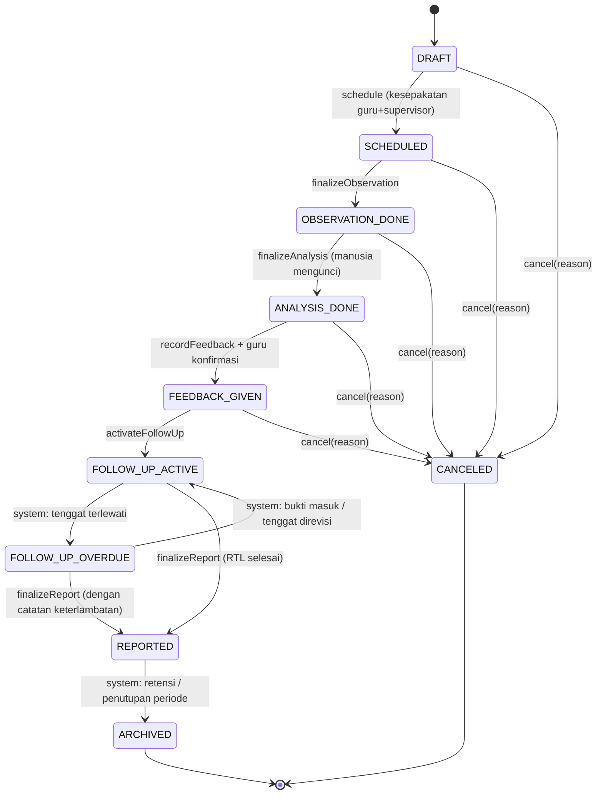

# State Machine — Siklus Supervisi

Sumber: Spec §5 (1:1 dengan 6 tahap operasional Spec §2.2). Master prompt §6.
Implementasi: `App\Domain\Supervision\Enums\CycleStatus` + `App\Domain\Supervision\StateMachine\CycleStateMachine`.

## Status

| # | Enum | Label | Tahap | Pemicu | Aksi sistem |
|---|---|---|---|---|---|
| 0 | `DRAFT` | Draf | — | Supervisor | Siklus dibuat, belum dikunci |
| 1 | `SCHEDULED` | Terjadwal | Perencanaan | Supervisor + Guru | Kesepakatan fokus & jadwal disimpan; notifikasi ke guru |
| 2 | `OBSERVATION_DONE` | Observasi Selesai | Observasi | Supervisor | Data observasi (instrumen) tersimpan & di-final-kan; kunci di audit trail |
| 3 | `ANALYSIS_DONE` | Analisis Selesai | Analisis | Supervisor (draft boleh AI) | Skor & pola dihitung; analisis final dikunci **oleh manusia** |
| 4 | `FEEDBACK_GIVEN` | Umpan Balik Diberikan | Umpan Balik | Supervisor + Guru | Sesi umpan balik terekam; guru mengonfirmasi penerimaan |
| 5 | `FOLLOW_UP_ACTIVE` | Tindak Lanjut Berjalan | Tindak Lanjut | Guru | RTL aktif; pengingat otomatis terjadwal |
| 6 | `FOLLOW_UP_OVERDUE` | Tindak Lanjut Terlambat | Tindak Lanjut | **Sistem (job harian)** | Eskalasi notifikasi ke supervisor |
| 7 | `REPORTED` | Dilaporkan | Pelaporan | Supervisor | Laporan final disusun & dapat diekspor |
| 8 | `ARCHIVED` | Diarsipkan | — | **Sistem (otomatis)** | Siklus dikunci sebagai data historis (analitik & PKB) |
| 9 | `CANCELED` | Dibatalkan | — | Supervisor | Siklus dihentikan, alasan tercatat (audit) |

## Diagram transisi

## Tabel transisi (guard)

| Dari | Ke | Aktor diizinkan | Guard (prasyarat) |
|---|---|---|---|
| DRAFT | SCHEDULED | supervisor | `planning_agreement` lengkap; `disepakati_guru_at` & `disepakati_supervisor_at` terisi; instrumen dipilih |
| DRAFT | CANCELED | supervisor | `reason` wajib |
| SCHEDULED | OBSERVATION_DONE | supervisor (observer) | ≥1 `observation` berstatus `final`; semua item `required` instrumen terisi |
| SCHEDULED | CANCELED | supervisor | `reason` wajib |
| OBSERVATION_DONE | ANALYSIS_DONE | supervisor | `analysis_result.status_review = final`; `finalized_by` = manusia (bukan `ai_*`); skor terhitung |
| ANALYSIS_DONE | FEEDBACK_GIVEN | supervisor | `feedback_session.status = selesai` **dan** `status_konfirmasi_guru = dikonfirmasi` |
| FEEDBACK_GIVEN | FOLLOW_UP_ACTIVE | supervisor | ≥1 `follow_up_plan` dengan ≥1 `follow_up_item` & `tenggat` valid |
| FOLLOW_UP_ACTIVE | FOLLOW_UP_OVERDUE | system | job harian: ada `follow_up_plan` `berjalan` dengan `tenggat < today` tanpa bukti memadai |
| FOLLOW_UP_OVERDUE | FOLLOW_UP_ACTIVE | system | semua plan overdue kembali `berjalan`/`selesai` (bukti masuk atau tenggat direvisi supervisor) |
| FOLLOW_UP_ACTIVE / OVERDUE | REPORTED | supervisor | `report` scope `cycle` berstatus `siap`; minimal semua `follow_up_plan` berstatus terminal atau supervisor konfirmasi override dengan catatan |
| REPORTED | ARCHIVED | system | kebijakan retensi / penutupan tahun ajaran; **tidak menghapus data** |
| (0–4) | CANCELED | supervisor | `reason` wajib; tidak boleh cancel setelah FOLLOW_UP kecuali admin_sistem + alasan |

Transisi **mundur** tidak diizinkan kecuali:
- OVERDUE ⇄ ACTIVE (dikelola sistem), dan
- "koreksi" via pembatalan + siklus baru (bukan rollback status).

## Kontrak implementasi

Setiap pemanggilan `CycleStateMachine::transition($cycle, $to, $actor, $context)`:

1. **Validasi** transisi ada di tabel + guard lulus → else `InvalidTransitionException` (HTTP 422).
2. **Otorisasi** `actor` via `CyclePolicy::transition` → else 403 + audit `authorization.denied`.
3. Dalam **DB transaction**:
   - update `supervision_cycles.status`
   - insert `cycle_status_transitions` (`from`, `to`, `actor_id`, `actor_role`, `reason`, `metadata`, `created_at`)
   - insert `audit_logs`
   - dispatch event `CycleTransitioned` (→ listener notifikasi, penjadwalan reminder, snapshot laporan)
4. Idempoten: transisi ke status yang sama = no-op (log `transition.noop`), bukan error.

## Aturan AI (Spec §6.6, §10, §11; master prompt §5, RULE 4)

- Tidak ada transisi yang bisa dipicu oleh agen AI.
- `finalizeAnalysis` menolak bila `analysis_result.finalized_by` bukan user manusia atau `sumber = ai_draft` tanpa `reviewed_by`.
- `recordFeedback` menolak pengiriman final bila konten identik dengan `ai_generations.output` yang belum `review_status ∈ {accepted, edited}`.

## Enum status turunan (bukan status siklus)

- `follow_up_plans.status`: `berjalan` | `terlambat` | `selesai` | `dibatalkan`
- `observations.status`: `draft` | `final`
- `analysis_results.status_review`: `draft` | `in_review` | `final`
- `feedback_sessions.status`: `draft` | `berlangsung` | `selesai`

Status siklus `6 FOLLOW_UP_OVERDUE` adalah cerminan agregat dari `follow_up_plans.status = terlambat` — dikelola job, bukan diset manual.
